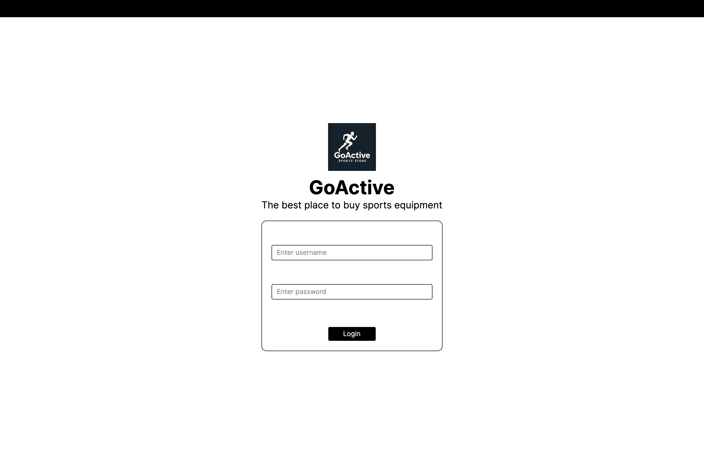

# 🏋️ Sportshop

**Sportshop** to aplikacja desktopowa umożliwiająca szybkie i wygodne zakupy artykułów sportowych bez wychodzenia z domu. Stworzona z myślą o pasjonatach aktywnego stylu życia.

<em>\*Logo wygenerowane przez Chat GPT</em>

## 🚀 Funkcje

- Przeglądanie produktów

- Zarządzanie zmówieniami

- Zarządzanie użytkownikami

## 🧑‍💻 Technologie

- C#

- Avalonia UI

- AWS

- PostgreSQL

## 🎮 Uruchamianie

- Preferowane środowisko: VSC Code

- .NET w wersji 8.0

- Aby uruchomić aplikacje poprzez CLI należy odpalić komendę <i>dotnet run</i>

- W panelu logowania:

  - Konto admina: login admin, hasło admin

  - Konto klienta: login customer, hasło customer

## 🔨 Poprawki od klienta

- Dodać panel dodawania klientów

- Dodać cenę do informacji o produkcie

- Dodać login klienta do informacji o zamówieniu

- Dodać możliwość przypisania wielu produktów do zamówienia

## 📖 Flow

[Link](https://lucid.app/lucidspark/9edb294a-635a-41d1-b574-a82a1559929c/edit?viewport_loc=333%2C-783%2C6018%2C3267%2C0_0&invitationId=inv_845b640b-abf9-4535-a644-f04a434ad9c9)

## 🗃️ Baza danych

[Link](https://dbdesigner.page.link/CkG3XqCDGpQrNk6y7)

- user - informacje o użytkownikach
- product - informacje o produktach
- order - informacje o zamówieniach

## 📊 Diagram UML

[Link](https://viewer.diagrams.net/?tags=%7B%7D&lightbox=1&highlight=0000ff&edit=_blank&layers=1&nav=1&title=studia.drawio.svg&dark=auto#R%3Cmxfile%3E%3Cdiagram%20id%3D%22C5RBs43oDa-KdzZeNtuy%22%20name%3D%22Page-1%22%3E7Z1bc6O4EoB%2FTapmH5IyV9uPsZ1kspvb5DKz52kKGyXWBoMHcC7z64%2FEzYBaNo4BkRrt2TobZIyF%2BlOr1d2SDrTx4u3Mt5bzS89GzoHas98OtMmBqqqKOST%2FoSXvcYnW1wZxyZOP7bhMWRfc4d8oKewlpStso6BwY%2Bh5ToiXxcKZ57poFhbKLN%2F3Xou3PXpO8VeX1hNiCu5mlsOW%2FsB2OI9LB2p%2FXf4V4ad5%2BsvZGy%2Bs9ObkTYK5ZXuvuSLt5EAb%2B54Xxn8t3sbIoa2XtsuP8%2FcfzsWzefb3t%2BCX9TD65%2F7q%2B2H8sNNdvpK9go%2Fc8MOPvuybI3yzHF%2B82%2BdvD7ejw99X3w77ybu9WM4qabDkZcP3tAWRax9TQZCrqePNng%2B0kW0Fc0Sfq5AL8vkpJj%2BlTXrxVQKBQlpoNA8XTnKf761cO%2FpWdN8bDv%2Blfx8ZydX%2Fcp9M3vIX78lFxXZI2ivwVv4MbXh504hvRHYBoaT5zpC3QKH%2FTm54XYOjmEmL%2BcixQvxSpMxKYH3Kvps97sbDpNJqL%2BlZA92Mv5L0q8N%2BKor0GXH1k6%2Fl5brtSQOj9KTQ8p9QyDyJCNV6z922pDcEG6qcPjf9IWOg559H%2FogfmV7l2nBdFFG5A6GKojGI3iH%2FBc9QwKAavOKFY7nkavQ6xyG6W1oRAa9EuRVh3A2lF%2BSH6G0jI8mnplmShmLoSbPlKSKlceG8oHu0kuTyHOWaefdWNCv08%2BAZhbN50tW8VehgF40zrUwLHz03HHuO50df0Mj%2FTmkdRk%2B%2BZWO0%2Fsz1IhE8Eq2Qu308VI2o7YPQ955R6eZMpdAfou2NiQ6%2FsKbIufECHGLPpfrHC0Nvkbvh2MFP9IPQo%2FK1kqsZqQvyiwKndc8rpug6eXn6k1awjF%2F0Eb%2FReoyi7oD8kxdEe0X8EDIELOkXFm9PdLg8sl4D%2Fci3g5%2FYDULLpawBZG3hujJbRqmnGyxY%2FQGLVVpWO1RDhqlr30Z%2B0js3dc584yuQ4GD5zubYsS%2BsdwInKSMtPntOr0Zzz8e%2FyWOtVODkYz%2BVuGoW7rij30zk7qOA3HOTikspFV1ab4UbL6wg7Q0zz3GsZYCn2WssiKLF7iiBNLppZzVUFyy6YhRgMQE1pKVleVxMfetYdkt6iuU%2BkffOfk7rFQcH1QTgBH6trPEshwDgWiEaUWshYBitZUTZrgup7ss0VWo3KiWdlmiuFF4HPYYAugts2070MEIBdp%2FuKcqTQ2VdchF9caKtS26TBtIisym0QmuaKSqnpBP9%2BN5RMnyT6hujA2MSlfhEJRPN5Fs4wgsReF8RBbikg7E7Rz4OqwM5rIxjxkM1%2BprSVSnVBaGbDn1lG7%2BQP5%2Fityf%2F9s5QGCmyYPT%2BECD%2F3P5CH30cEeIT6fwVX0T3JI2dPIpUrfA04AfioqlfLil%2FtQQkaWZWbMA4W43JWJ0W8dNZ%2FGiRR7776ETW%2F5yQjFwAySJ6IyLWMTXrabuMybWyvt7KZT36cmc8Nb0ano0ZaEqf4fPG9%2BzVLJTDaSeG0%2BLwZhpGRWA2jKb7AcNaX3IU23EUyzrdpxnGVHYyTIcoqSO6oCP6Q71kclccVcymRhXVkEpiXyWhVuegK0rCBKRODdvxHM2ezx%2Bpxjh5w0EYfHE80nvyti212GijBMGr50NWL%2F3ygXYqDdS9tMvuUFW1UFPh104VO4E6XmI54oi1SgdFJ08WdctRovYgSoZNYaL02JkMmdVaC9oo7jSg%2FzkkH9u0gwbowXeK6gdWK7nWrDoGRaLk6gDaza1V6AWJS3gH1VVRnHplYfKHDVB2zc1Be9Ccgiu6G2CQ%2BJPlZwiXnwJFefhdLxrJpewiU0y87CCvNFd2V9YCSdklnyrihafupDiJeSmFl3yqtyi83t%2F977P%2B1e1YCX9%2B%2B2qad9%2FPTg6r68y7JKGESu5q%2BRT8cibr0j9Zhn3RHRCa8Eo3x05ujt3N1V5FqTc104DmGUn4jvbLL79WiMaJGQ8G%2FfA%2Ban4ZnxPk%2FtgdtnSE3TqxrcGpBg4TrHlGh4Wxj6wwzZIivfcuAu3LX1WGd8lKQ6wAmS7tssJag5SVCQ6WXoBSOF488gyJRrtomIP20IAdv6yL5eQtRGmq05a861xytXlQzrzmp1q7pOZxrrU%2BHKQFNN1aOeqpelqwzrmOrt7zVzfEmCANQB0GNWZvb3aDbs3fTppSRPp2mvqchfrKpm3V7G3yoCNjmPun8FijZx71emrx0Zx07rrS4zR2QtQeoUqezgSuTWx2AcM0lhPLZbvBKoLXfirVDKyPrjYYbnlQ03SydliL%2BvMT0pnmuHSZTr20sqRfXsFSlU5T2fKghuk0WTofAtY3lCPTW0amVmnVVGF9VcNLqPbkS6%2BIV4qKkNG6lJyuqx%2Fly9zyoKb5gnwe29Vevcv19Mqw5QxPozcsGp40TvxBw7NctivT21nVQVYrLylsyQQdFHVdf%2FhRE1Q96inFZ%2FX0drkedIDrghKlLbIR7Ro47DReZk8v4TU4UvvreUr%2FY7ANzdJjlWoadNfFquXfGRr9ErgNrFU1oXTL2H28LMBs%2FlrRVeNJLtGBdtxbvmWXh5Hb5liPiqhD6DBx8xxnmVPrJ5Td1DhXEAexHPbqnD7mkTpf0uLiV8qOb7zdPT5NC86zXOTs61PAl74sl8192kLp9gHp6yn5NwUacOrRRTiHyQfHgedQAW1on13kEHvVEkFAj0yiDceUjHz73hdbMvX43RcXC4ExBqZdmqjwtYs2Vxhc73TfajUflrYVlqo5ibNTbzfWNr7HDr0k2pPU%2FrbV2sdxgVLtj4C6C67npbWk4bDNNNDYdyl0BhPdZpVviSWwtdb0pqzi5GIzySWDY%2FMa88TlnvObP0bWR97UgLzcuxoJOySD6tpR3yiNekCM1jSPkrsKmw%2FopYG4xuwYdtYyub%2FeZ%2FeGQtqvBrZqQ9s5qL10FXOuSQ0ohKAPm2rQPmstx9oyWpFKON3UsuV9D%2FZLtwZiUp86A7v6grDMtVDgw1AZOJQBAIdSnmDVBweUw0v15reV5YY4TDIiUvNaBh8%2FCkvWC%2FdJ8AbhaCxjJv0xho0bH6eJbba3ilJjJButslFVcTTHBpR%2FTNmI93QhDb4KcvseJAUSk3Yx6bP5C%2B1iMmRVSDzXkbZH67ZHtqFOZ4yPIU%2BJSOOj5g1OepVh6YrxMVS5xke0z8l5pYVkko%2BG%2BBBugAzZrS0ST2C0B5OEQyAcws2OAas8YpdHojyk4SHQ6ZFl0IozPAY85VF1oaRUHZVgyfrh57E70kxdBo0JCmY%2BXsaLriQhwggRbnkMoLC9dIt1gQ3hhseQjbXE%2Fg5peHTA49EBy2PIi7dIy6PeScvnC7coPV68RZoe3UBEuOmh9HgeU2l7iIZDuO0xYLe1iJ0e1CMmDQ%2BBHg8NON0AZCNVMPWzwdv9grJx%2F75E6906oyupPPYhJuuJn8n4YF2m8cxFag%2FR05bK6qO5aYvS43lML9gtgaXu2IeXrCN%2BJuXBc5rusumnBKQpQDowb%2BH5TKX90Q1EhM9eFIV1nUbny3bx2EYl281uY6K%2FqQIt2Fyivw4k%2BtNNe6Xl9kHLrboPIP1UKy0jVdheBe3CX8tJnu5ieH1x2ptO%2Fnsf3j5cPQVf%2F5mB25VSvSszZOrcWKwWZ3OrxzMYPDCkPS%2BaDchaa5cNrpNZWvPi8YAstXbxYD1F0pbvECDZbFwYIRrrDohPP5WWaFuWqKYXLVFFBXyIJgRFHVSApihvVJGmaI3qIut6e5miMBhNaQve%2BXM3q6mDZxIPoXjogLnRLh680KVcJCaaDcDlBbPRmKHBy6aT6TCi2RhWHVYaO4BSrlD%2FBJgo6bjRBiegWcoLbE%2FojlzpblBSf7QORmXDozE%2FB3%2BdR5TLH8ORXkg%2BWuajD3g52uWDN29Zn5QJht8kGQ1PaKFVHu2aHuyYwlMT0gPWlAesHIutHFdpLhjLc5xLF0edDvPqO2F2JRir8ywNuShMMBrCY7E6z8iQa8K6QYjwcKzO849KH5hoNsRHYrOwX%2F4ALHe12JhUybZHU7sja5CpDtvq5YPD6pvGQQ6gDp7CgIjYGjiAYZ2m8YkOYCg0MLkj18a9TDzkbyqh4v%2FzN4svicIhKsO3aPYxv1mrb2DfQoU3nhPRyapnnNHjbo8nl%2BdXu0IotMbjh7v768uT2%2BqVLqlcsScGZCND9ZwSozijNgDlPYQm1OVDe%2BqL%2F%2F3ZursQuJLqW6pvccrw%2FOrnze312e3J3d2nUuKT66uTP0aBmyIVOOgRZRNFvyJnifwuLvpSS2cZw9MXzWhq9gI2IDv5zw0KZD4cvR4bg5JhhzIjG%2FGsfqhSEREgRqlCs9s69v0AXwA6KJNq0ISMLwGcBvOXdCnWxlD17R%2F44QgQmuYStdk41XeMXj%2BHTobW4YI6uZZ1uHD7sbOSaFUdbUSpiT%2FWizImK6NRIgOK5PQBLFJ%2Ffv1UsLZOZDi7OMRERf4mmnSxJHJyw%2FQA0BePPFAq372wqSUYDHHSnPZlg8GUk2t3tCK9yh07ePYsCRFISFVN0hwhwAGZVjCfepZvyzGmzTHGLI4xignY%2B2CKkdEYG6zFL0eZxnVILTZ%2BU4FhuMrsypl4lLkjIrteSTpE0gGMMO3SAWQNxHSM52j27Ek8hOIBpBy1jAe7tCrGI3Ih3aIFEcSXALl2mgcfm66SGXHMQKlILUPDepViaGgGimSmi8xorCutZWZYT1o6AsmJTpsTnexsik1bEkOT4Fq2JIbZkP609pWI%2Bvn8aSrPn3a3mi6whEMkHMJdaSq7vCKZ6FjuDDkSDoFwQCsr2oWD9bNSq6OzuxJrpUH6UDF0dpjWQIdkg4segX2dCWQ%2FsGt7r1l7VjXllFxPylLC4L60n8X3ic07decTJ0p%2BbIAaFdrKOvN31w8Nb2Of2cqnbx9Z%2F5Fq9qb%2FIbn9wr7E1LGBMYhIc9u2wO6EhI94C4ZTuQuDMEAgH3a7gEA7XJcgcHAk3BiCH0lNlQ8RsCCydNBa5PeUiMmhwmChsVhoAAKONUXOjRfgeIXvxI%2FvLaGxTfpFvLE7Rz4OmxQ75JuGxN5Ulo3G2%2FXrFtnYJyPFvZfFyqV1L1A%2FDIQPILwzi9akRFl7khKBlCiK8GGEtzfHGhMZFO0CKVrFkac5Ulh3QZb2K%2Be4XZvjqsCG6PAkt7E8cY23OmNFJiyu3PqnToWi1ZKi1ao%2B0XkGylIewyIeD%2BHzW%2B6mYcj3Pf8SBYH1JDWISESqzoWbQ0S6QPZ2gewudjDVqk0fCHfPuGu3MKO9t4JnqRRaVgriZ7TAxvjUc%2F6diNK2QlRARI4cYiARPpnV4fCK9KJ2DBRoxVG7oGxYjCa9Hl3zeuhQSi%2FEi6Y3BgzP6xHtLZXfiyIx76RO2QcZ%2FRM6PnjJH9QvFuRi%2BpIPEXwI93xwz67GwbG9SDcGm3qegyxX4tEyHsK9Htxzewq5QTIxSBAfld0jdQDydWT17vtv1wvjHP17%2FfXnHP894B5Ei4PI7AguPMums95MjUhGNjHCiL4yNrutPGuVEXb6mzJClYZERDwiRotmKogI7%2BDAYO69XnmxKimEYSQnIjgZCDdXofFGRmF2isJ8YBbbE5yJavCGELmLRifsUFUR7ecATx6JCclvpIELiR4SGYHI6MLHEl5OUGEbDUlMZ4gxhXtDeMkAcqOvDuAxFB2%2BM9jwHY3z3qEwi%2BJNSKuf%2Bt7ieIklLAJh0apmLDc242UHn%2FxuPDLau1u09yOTXZUz2YWjvf2hcWRUYyaDq3ZoeN74ZXwidhLPS8%2FHliG9fbnh99xORHzB6vFslAA5aBYiO6UjXdHNO01dctIoJ21GfsHq8Y66%2FbWy3BCH7zEdtLkkGa2S0WbQF6weL6lIxnw7QIf4kC8vo0iulekIIcIDvukRdzLi21VEhAd8FV7iiIz4domTNgO%2BMCdQ5K8EwR8e8G1gDttivBeWOj%2BaJ3eaFa0UWg32wnjwI3dyr1nheLQZ2IXxgOMw6aJMmTHSAUjajOXCkMCHe8lgXfdYaTCwSy59j55sn312Rt5rHofftJP%2FAw%3D%3D%3C%2Fdiagram%3E%3C%2Fmxfile%3E)
